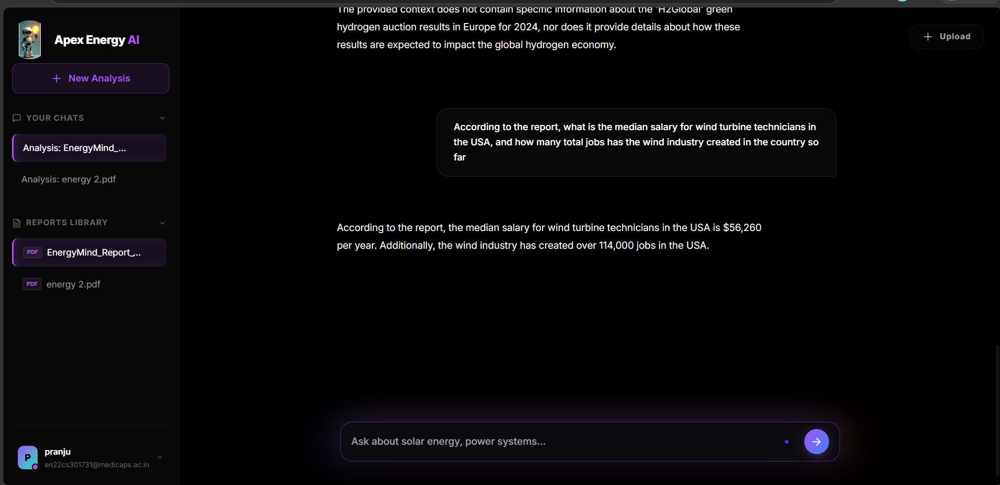
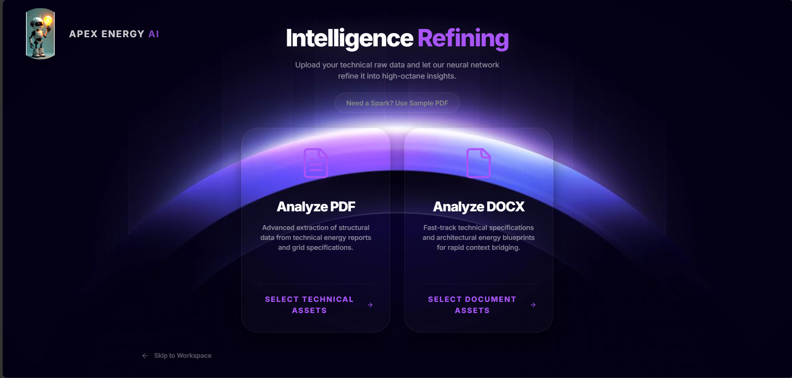
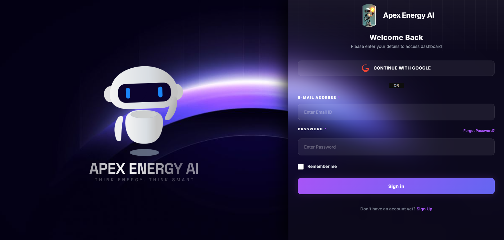
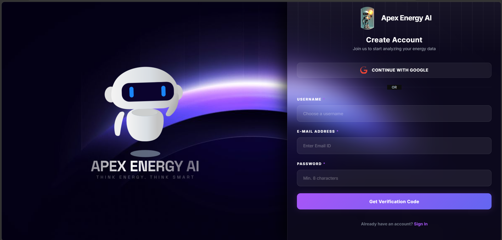
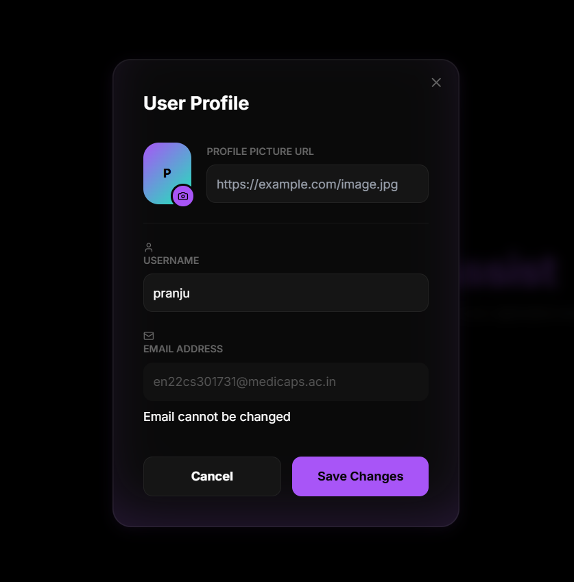

# ⚡ APEX ENERGY AI - Nebula RAG Systems

> [!IMPORTANT]
> 🌌 **The Future of Energy Intelligence.** A high-performance, agentic RAG platform designed for the complex document retrieval needs of the energy sector.

---

**Apex Energy AI** is a premium, production-grade Retrieval-Augmented Generation (RAG) platform, now rebranded with a futuristic **Nebula Purple** aesthetic. It enables engineers, analysts, and grid operators to harness neural-powered search on complex technical documentation (PDF/DOCX) through a sleek, cinematic interface.

---

## 📸 Interface Preview

<p align="center">
  
  
</p>
<p align="center">
  
  
  
</p>

### Visual Identity:
- **Electric Purple Theme**: A cinematic "Nebula" dark mode built with smooth gradients and glassmorphism.
- **Agentic Chat**: A clean, rounded-rectangle input box with integrated auto-resize and halo-glow effects.

---

## 🛠️ High-Performance Architecture

Apex Energy AI is built on a state-of-the-art stack optimized for real-time intelligence:

- **Frontend**: `React 18`, `Vite`, `Vanilla CSS & Tailwind`, `Lucide Icons`.
- **Backend**: `FastAPI` (Python 3.11), `JWT Auth`, `FastAPI-Mail` (Verification Hub).
- **AI Engine**: `Groq` (Llama-3.1), `SentenceTransformers` (Neural Embeddings), `LangChain`.
- **Infrastructure**: `Qdrant` (Vector Store), `Redis` (Atomic Chat Memory), `Docker` & `Kubernetes` Orchestrated.

---

## 🚀 Quick Launch (Local Setup)

Follow these steps to deploy Apex Energy AI on your local terminal:

### 1. Initialize Repository
```bash
git clone https://github.com/pranjal1712/energymind-ai-agents.git
cd energymind-ai-agents
```

### 2. Environment Synchronization
Create a `.env` file in the **root directory** and the **backend directory** (or use the synchronized loader) with your credentials:
```bash
# Core AI Keys
GROQ_API_KEY=your_key_here
TAVILY_API_KEY=your_key_here

# Security
SECRET_KEY=generate_a_secure_random_key

# Email Verification (SMTP)
MAIL_USERNAME=your_email@gmail.com
MAIL_PASSWORD=your_app_password
MAIL_FROM=your_email@gmail.com
MAIL_FROM_NAME="Apex Energy AI"
```

### 3. Execution

#### **Backend (FastAPI)**
```bash
cd backend
python -m venv venv
./venv/Scripts/activate # Windows
pip install -r requirements.txt
uvicorn main:app --reload
```

#### **Frontend (Vite)**
```bash
cd frontend
npm install
npm run dev
```

---

## 🚀 Visionary Features
- **Neural Identity**: Secure Signup -> OTP Verification (Purple Branded) -> Intelligent Hub.
- **Domain-Specific RAG**: Optimized for solar, power grid, and sustainable energy documentation.
- **Cinematic UX**: No internal scrollbars, fluid animations, and a floating AI agent logo.
- **Hybrid Search**: Combines vector retrieval with agentic research capabilities.

---

## ☁️ AWS Deployment (EC2 + Docker)

Follow these steps to set up your production environment on AWS:

### 1. EC2 Instance Setup
- Launch an EC2 instance (Ubuntu 22.04 LTS).
- Security Group: Allow inbound traffic on ports **80** (HTTP), **443** (HTTPS), and **8000** (Backend API).

### 2. Install Docker & Docker Compose on EC2
```bash
sudo apt-get update
sudo apt-get install -y docker.io docker-compose-v2
sudo usermod -aG docker ubuntu
# Log out and log back in for group changes to take effect
```

### 3. CI/CD Configuration (GitHub Secrets)
Add the following secrets to your GitHub Repository (**Settings > Secrets and variables > Actions**):
- `DOCKERHUB_USERNAME`: Your Docker Hub username.
- `DOCKERHUB_TOKEN`: Your Docker Hub Personal Access Token.
- `EC2_HOST`: The Public IP of your EC2 instance.
- `EC2_SSH_KEY`: Your `.pem` file content.
- `VITE_GOOGLE_CLIENT_ID`: Your Google OAuth Client ID.

---

## ☸️ Kubernetes Orchestration (Scaling & High Availability)

For large-scale production, Apex Energy AI is ready for Kubernetes deployment.

### 1. Structure
All manifests are located in the `k8s/` directory:
- `namespace.yaml`: Segregated environment (`apex-energy`).
- `secrets.yaml`: Template for secure environment variable management.
- `backend-manifests.yaml`: Deployment and ClusterIP service for the API.
- `frontend-manifests.yaml`: Deployment and LoadBalancer service for the UI.

### 2. Manual Deployment
```bash
kubectl apply -f k8s/namespace.yaml
# Update k8s/secrets.yaml with base64 encoded values, then:
kubectl apply -f k8s/secrets.yaml
kubectl apply -f k8s/backend-manifests.yaml
kubectl apply -f k8s/frontend-manifests.yaml
```

### 3. CI/CD with Kubernetes
The project includes a dedicated `.github/workflows/k8s-deploy.yml` workflow. To activate it:
1. Add `KUBECONFIG` content as a GitHub Secret.
2. The pipeline will automatically build images, push to Docker Hub, and update your K8s cluster on every push to `main`.

---

## 🔧 IDE Troubleshooting (Red Squiggles)

If you see "Unable to resolve action" warnings in VS Code:
1.  **Trust Workspace:** Ensure you have clicked "Trust Workspace" when opening the project.
2.  **Login:** Click the "Accounts" icon in the bottom-left and **Sign in to GitHub**.
3.  **Settings:** The project includes a `.vscode/settings.json` that automates these fixes. If they persist, run `Developer: Reload Window` from the Command Palette (`Ctrl+Shift+P`).

---

## 📜 License

This project is licensed under the **MIT License** - see the [LICENSE](LICENSE) file for details.

---
*© 2026 Apex Energy AI. Developed by Pranjal Sharma. Rebranded & Refined for the next generation of energy intelligence.*
